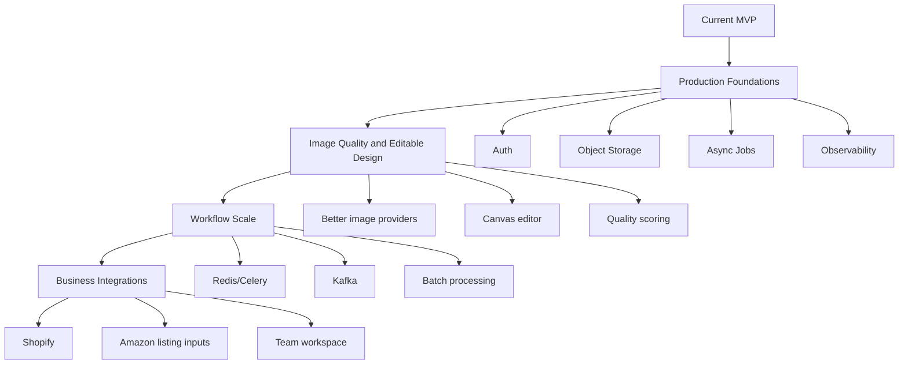
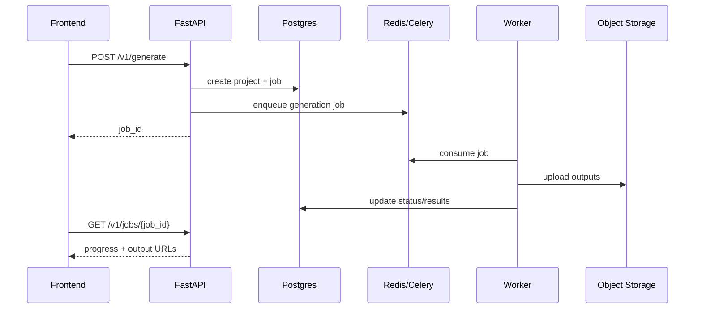
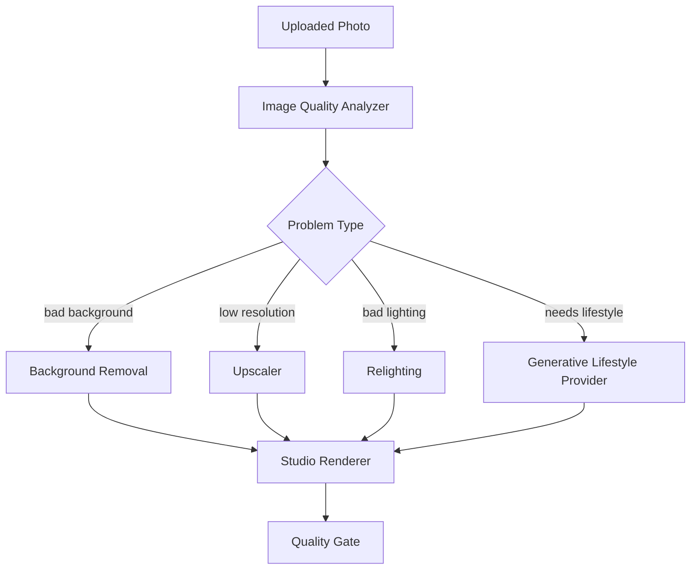
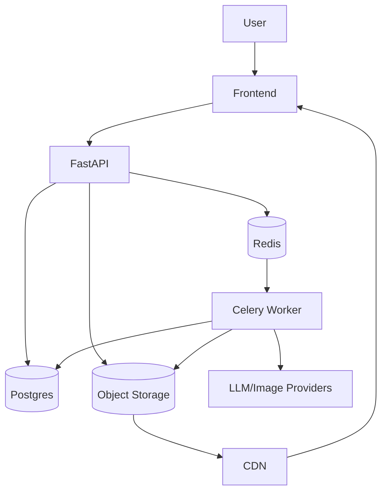

# Future Scope

## 1. Purpose

This document captures the next production and business-ready improvements for Listing Autopilot.

Current version proves the core workflow:

- upload a product photo
- generate an upgraded Amazon-ready image
- generate listing copy and creative direction
- render an editable listing design preview
- save recent projects with Postgres

Future work should make the system reliable at scale, easier to operate, safer for real customers, and closer to a commercial Pixii-style product.

## 2. Prioritization



Recommended order:

1. Object storage and output serving.
2. Async job execution with Redis and Celery.
3. Authentication and tenant isolation.
4. Image quality pipeline improvements.
5. Separate frontend with real editable canvas.
6. Batch and event-driven workflows.
7. Shopify/Amazon integrations.

## 3. Storage

### Object Storage

Current local files in `outputs/` are fine for demos but not production.

Add object storage for all generated and uploaded assets:

- S3, Cloudflare R2, GCS, or Azure Blob Storage.
- Store original uploads, upgraded product images, editable previews, generated exports, and future video outputs.
- Save only storage keys and public/signed URLs in Postgres.
- Use lifecycle policies for expired demo assets.

Suggested model changes:

- Add `storage_bucket`.
- Add `storage_key`.
- Add `cdn_url`.
- Add `expires_at`.
- Add `checksum_sha256`.

### CDN

Use a CDN in front of object storage so image previews load quickly for customers.

Useful CDN features:

- cache resizing variants
- signed URLs
- image optimization
- regional edge delivery

## 4. Async Processing

### Redis

Use Redis for:

- Celery broker/result backend
- short-lived generation state
- rate limit counters
- provider response cache
- temporary job locks

### Celery

Move long-running generation out of Streamlit/FastAPI request threads.

Good Celery tasks:

- image upgrade
- product analysis
- creative pack generation
- editable design rendering
- export packaging
- batch generation for many SKUs
- webhook delivery

Expected API flow:



### Job Status

Add explicit status transitions:

- `queued`
- `running`
- `image_processing`
- `copy_generation`
- `design_rendering`
- `completed`
- `failed`
- `cancelled`

Add progress fields:

- `progress_percent`
- `current_step`
- `started_at`
- `completed_at`
- `error_code`
- `error_message`

## 5. Event-Driven Scale

### Kafka

Kafka is not needed for the current MVP, but it becomes useful when the product supports high-volume workflows.

Use Kafka for:

- project created events
- generation completed events
- image provider usage events
- customer analytics
- billing usage metering
- webhook retries
- downstream indexing/search

Example topics:

- `listingautopilot.project.created`
- `listingautopilot.generation.started`
- `listingautopilot.generation.completed`
- `listingautopilot.generation.failed`
- `listingautopilot.asset.created`
- `listingautopilot.usage.metered`

Kafka should come after Redis/Celery unless there is a clear real-time analytics or multi-service requirement.

## 6. Image Quality

### Better Provider Strategy

Current providers:

- demo/local image cleaner
- OpenAI image editing
- Gemini image editing

Future providers:

- Replicate models for background removal, upscaling, relighting, and product photography.
- Stability AI for product-to-studio transformations.
- Cloudinary for deterministic cleanup, background removal, resizing, and CDN delivery.
- Remove.bg or similar for strict subject cutout.

Provider selection should be policy-based:

- default provider by account
- fallback provider by failure code
- cost-aware routing
- product-category routing
- image-quality routing

Example:



### Quality Gate

Add automated checks before accepting a generated image:

- subject is large enough in frame
- background is acceptable
- output is square
- product is not duplicated
- product is not cropped incorrectly
- text/logos are not visibly corrupted
- no unsafe or policy-problematic output

If quality check fails:

- retry with stronger prompt
- route to another provider
- fall back to deterministic local cleaner
- show clear warning to user

### Image Variants

Generate more than one output:

- main image
- studio hero image
- lifestyle image
- infographic image
- square marketplace image
- vertical social image

This is closer to a business-ready creative system than a single image output.

## 7. Editable Design

### Real Canvas Editor

Current editable JSON is useful, but the dashboard is not a true editor.

Build a separate frontend repo with:

- React or Next.js
- Fabric.js, Konva, or Polotno-style canvas editor
- drag/drop layers
- text editing
- image resize/crop controls
- brand colors
- export to PNG/PDF
- version history

Suggested separate repo:

```text
listingautopilot-web/
├── src/
│   ├── app/
│   ├── components/
│   ├── canvas/
│   ├── api/
│   └── design-system/
├── package.json
└── README.md
```

API contract should remain backend-owned. The frontend should consume:

- `GET /v1/projects/{id}`
- `GET /v1/designs/{id}`
- `PATCH /v1/designs/{id}`
- `POST /v1/designs/{id}/render`
- `POST /v1/designs/{id}/export`

### Design Versioning

Add version history:

- design draft version
- rendered version
- published version
- rollback support

This is important because Pixii's core differentiation is editable designs, not just generated images.

## 8. API And Backend Hardening

### Authentication

Current OpenAPI includes bearer auth shape, but auth is not enforced.

Production needs:

- JWT verification
- Auth0, Clerk, or custom OAuth
- user/team/customer mapping
- role-based access control
- API keys for programmatic usage

Roles:

- owner
- admin
- designer
- viewer
- API-only service user

### Multi-Tenancy

Strengthen tenant isolation:

- every persisted row must include `customer_id`
- all queries filter by `customer_id`
- add indexes on `(customer_id, created_at)`
- test cross-tenant access denial

### Rate Limits

Add rate limits by:

- user
- customer
- IP
- provider
- endpoint

This protects API spend and prevents abuse.

### Provider Cost Controls

Track:

- provider
- model
- prompt tokens
- output tokens
- image generations
- retries
- cost estimate

Show usage in dashboard/admin reports.

## 9. Database

### Postgres Improvements

Add:

- stronger indexes
- normalized job table
- provider run table
- asset lineage table
- generation usage table
- audit log table

Recommended tables:

- `generation_jobs`
- `provider_runs`
- `asset_versions`
- `usage_events`
- `audit_logs`
- `team_members`
- `api_keys`

### Search

Add search over:

- project names
- product names
- categories
- generated titles
- saved design metadata

Use Postgres full-text first. Add OpenSearch later only if search grows.

## 10. Observability

### Metrics

Current Prometheus endpoint is a good start.

Add metrics for:

- generation latency
- provider latency
- provider failure rate
- fallback rate
- image quality rejection rate
- job queue depth
- cost per generation
- daily active users

### Logging

Keep structured logs:

- request id
- project id
- customer id
- provider
- model
- job status
- failure code

Avoid logging:

- API keys
- uploaded image binary
- private customer data beyond useful IDs

### Tracing

Add OpenTelemetry for:

- API request
- job creation
- provider calls
- storage upload
- DB writes

## 11. Deployment

### First Production Shape

Recommended services:

- Streamlit or React frontend
- FastAPI backend
- Celery worker
- Redis
- Postgres
- object storage
- CDN



### Deployment Targets

Free/low-cost:

- Streamlit Community Cloud for demo dashboard.
- Render/Railway/Fly.io for FastAPI.
- Neon/Supabase for Postgres.
- Cloudflare R2 for object storage.

Production:

- AWS ECS/Fargate or Kubernetes.
- RDS Postgres.
- ElastiCache Redis.
- S3 + CloudFront.
- Managed secrets.

## 12. Business Features

### Shopify Integration

Build a Shopify app:

- connect store
- import product photos
- generate listing creative pack
- push generated images back to product media
- update title/description/metafields
- batch process products

### Amazon Workflow

Potential Amazon-focused features:

- listing URL ingestion
- competitor URL ingestion
- review mining
- Rufus/AEO diagnostics
- image compliance checklist
- title and bullet compliance scoring
- category-specific creative templates

### Team Workflow

Add:

- comments
- approvals
- share links
- export history
- brand kit
- workspace billing

## 13. Security

Production requirements:

- upload file validation
- malware scanning for uploads
- signed object storage URLs
- secrets manager
- strict CORS
- request body limits
- image content moderation where needed
- audit logs for project/design changes

## 14. Testing

Add:

- integration tests with Postgres
- Alembic migration tests
- provider contract tests
- image quality regression tests
- Playwright tests for frontend/dashboard
- load tests for generation queue
- golden sample outputs for key product categories

Image quality tests should validate:

- subject size ratio
- square output size
- no excessive whitespace
- no blank images
- preview text fits layer bounds

## 15. Near-Term Roadmap

### Phase 1: Harden Current Demo

- Improve image quality checks.
- Add clear provider fallback warnings.
- Add object storage abstraction.
- Add API error response consistency.
- Add more sample product tests.

### Phase 2: Production Backend

- Add Redis/Celery.
- Add job status APIs.
- Add Auth0 or another JWT provider.
- Add tenant-safe project APIs.
- Add provider usage tracking.

### Phase 3: Editable Frontend

- Create separate React/Next.js repo.
- Build canvas editor for design JSON.
- Add layer editing and render/export flow.
- Add design versioning.

### Phase 4: Business Integrations

- Shopify app.
- Amazon listing ingestion.
- Competitor and review analytics.
- Batch generation for multiple SKUs.

## 16. Out Of Scope For MVP

These are intentionally deferred:

- Kafka event streaming.
- Full marketplace publishing.
- Real-time collaborative editing.
- Enterprise SSO.
- Billing system.
- Multi-region deployment.

They are useful later, but they would slow down the assignment version without improving the core demo.
