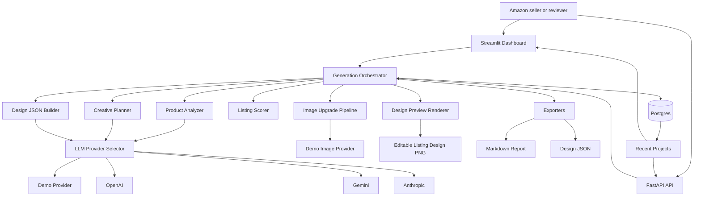
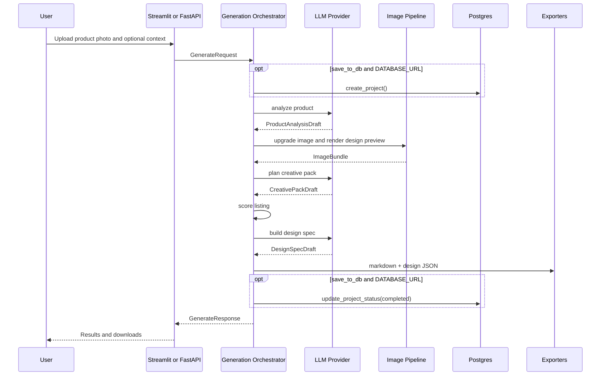
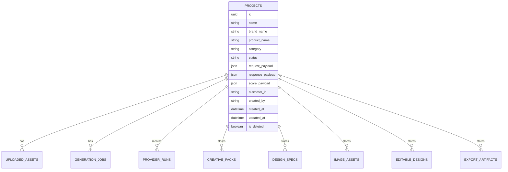
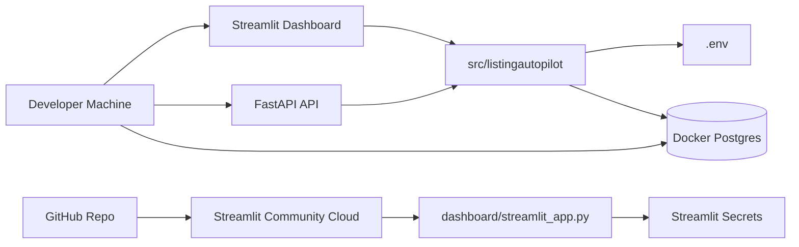
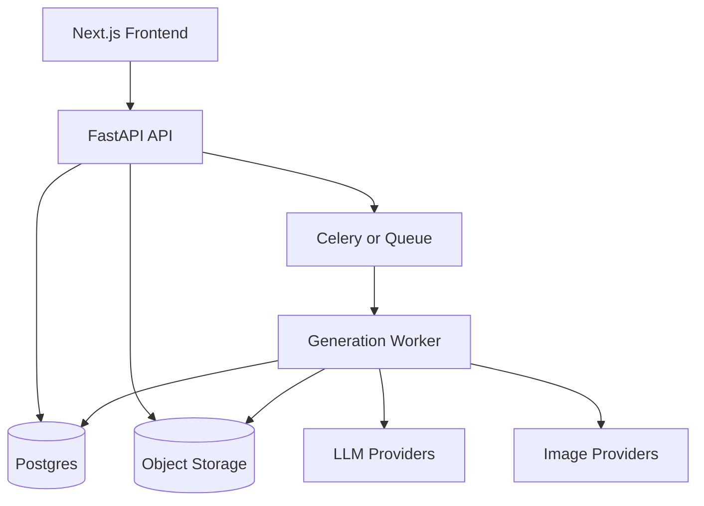

# High-Level Design

## 1. System Overview

Listing Autopilot is a Python product repo with a Streamlit dashboard, FastAPI service, editable photo upgrader, modular generation pipeline, and optional Postgres persistence.

The first deployable experience is the Streamlit dashboard. The FastAPI app exposes the same generation flow for local API testing and a future standalone frontend.

## 2. High-Level Goals

- Let a seller upload one product photo and receive an upgraded Amazon-ready product image plus a usable listing creative pack.
- Render a Canva-style editable listing design preview from layer JSON.
- Keep the UI thin and make service modules reusable from Streamlit and FastAPI.
- Support demo mode without external API keys.
- Support live LLM providers when API keys are configured.
- Persist generated projects only when Postgres is configured.
- Keep the structure close to a production service without overbuilding the first version.

## 3. Current Architecture

## 4. Runtime Modes

### Demo Mode

Demo mode is the default and always available.

Behavior:

- Product analysis uses deterministic structured output.
- Image upgrade uses the demo image provider to create a white Amazon-style product image.
- Design preview renderer turns editable layer JSON into a PNG preview.
- Creative pack and design JSON are generated through stable schemas.
- The workflow can be reviewed without API keys.

Purpose:

- Assignment reviewers can run the app immediately.
- Tests are stable.
- The product story is visible even when external providers are unavailable.

### Live Mode

Live mode is used when an LLM provider is configured and selected.

Supported live LLM providers:

- OpenAI
- Google Gemini
- Anthropic Claude

Behavior:

- Provider selector builds the configured client settings.
- Product analysis, creative planning, and design spec generation use the selected provider path.
- OpenAI and Gemini also use live image-editing providers for the upgraded product image.
- Anthropic is text/design only in this version, so image processing uses the local demo image cleaner.
- If the selected provider is not configured, the app falls back to demo mode and returns a warning.

### Mixed Mode

Mixed mode happens when a live text/design provider is used but image processing uses another provider.

Expected examples:

- Anthropic text/design output with local demo image cleaning.
- OpenAI or Gemini text/design output with OpenAI or Gemini live image editing.

## 5. Main Components

### Streamlit Dashboard

Responsibilities:

- Product photo upload.
- Optional product context input.
- Model provider selection.
- Save project toggle.
- Recent Projects sidebar when Postgres is configured.
- Result display and download buttons.

Non-responsibilities:

- No prompt construction.
- No scoring logic.
- No provider-specific logic.
- No direct SQL beyond calling project CRUD helpers.

### FastAPI Service

Responsibilities:

- Health, provider, generation, and project endpoints.
- Multipart upload validation.
- CORS registration.
- Prometheus metrics.
- OpenAPI bearer auth schema for future auth integration.

### Generation Orchestrator

The generation orchestrator lives in `listingautopilot.api.generation`.

Responsibilities:

- Build request context.
- Optionally create a project row.
- Select the LLM provider.
- Run analysis, image upgrade, creative planning, scoring, design JSON, and exports.
- Optionally update project status and saved payloads.
- Return one `GenerateResponse`.

### LLM Layer

Responsibilities:

- Define provider settings.
- Detect available providers from environment variables.
- Provide demo fallback.
- Keep provider selection independent from UI and API code.

### Image Layer

Responsibilities:

- Return original/upgraded image references.
- Render an editable listing design preview image.
- Hide image-provider details behind `upgrade_image`.
- Use demo, OpenAI, or Gemini image providers behind the same pipeline.

Current implementation:

- Demo provider creates a `2000x2000` Amazon-style white canvas, centers the product image, improves contrast/sharpness, and adds a subtle shadow.
- OpenAI provider calls the image edit API and normalizes the output to a `2000x2000` PNG.
- Gemini provider calls Gemini image editing and normalizes the output to a `2000x2000` PNG.
- Design renderer creates a PNG preview from editable design JSON layers.

Future implementation:

- A production image generation, cleanup, or upscaling API.
- Object storage for generated assets.

### Analysis Layer

Responsibilities:

- Product analysis.
- Listing score.
- Creative pack planning.
- Editable design JSON building for the Canva-style preview.

### Export Layer

Responsibilities:

- Generate Markdown report.
- Generate design JSON string.
- Keep export formatting outside the UI.

### Persistence Layer

Responsibilities:

- SQLAlchemy models.
- Pydantic DB schemas.
- Project CRUD functions.
- Soft delete and search helpers.
- Alembic migrations.

Persistence is optional. If `DATABASE_URL` is missing, generation still works and Recent Projects is disabled.

## 6. Data Flow

## 7. Persistence View

## 8. Deployment View

## 9. Key Design Decisions

### Decision 1: Streamlit First

Reason:

- Fastest hosted demo.
- Suitable for a 4 to 6 hour assignment.
- Easy for reviewers to run and understand.

### Decision 2: FastAPI Included

Reason:

- Shows production service thinking.
- Gives a path to a future frontend.
- Makes the generation pipeline usable outside Streamlit.

### Decision 3: Demo Fallback

Reason:

- The app must run even without API keys.
- Reviewers should see the workflow immediately.
- Tests should not depend on paid external providers.

### Decision 4: Optional Persistence

Reason:

- Core pipeline remains simple.
- Recent Projects demonstrates product readiness.
- Postgres/Alembic shows production direction without blocking demo deployment.

### Decision 5: Editable Design Preview Plus JSON

Reason:

- Aligns with Pixii's editable-design value proposition.
- Shows a real image output while keeping every layer editable in JSON.
- Separates this project from simple copy generation and flat photo generation.
- Creates a clear path to a future canvas editor.

## 10. Future Architecture

Future additions:

- Production auth and tenant management.
- Real image generation/upscaling provider.
- Object storage for uploaded and generated assets.
- Async job queue for long-running image generation.
- Batch SKU generation.
- Full editable canvas frontend.
- Shopify or Amazon listing publishing flow.
