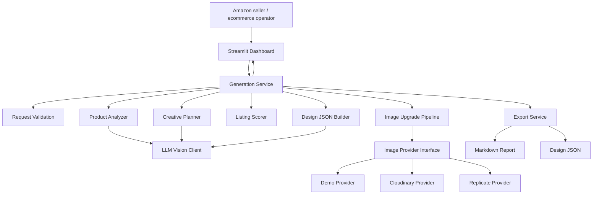
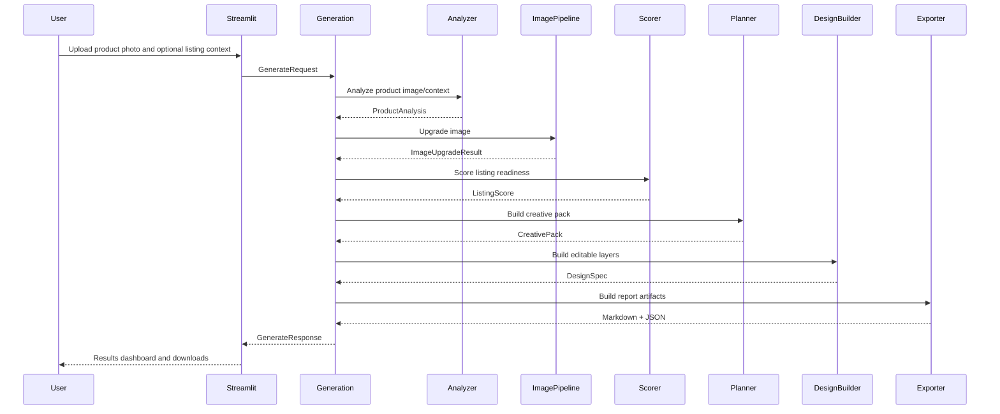
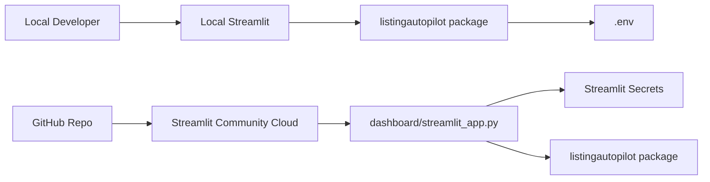
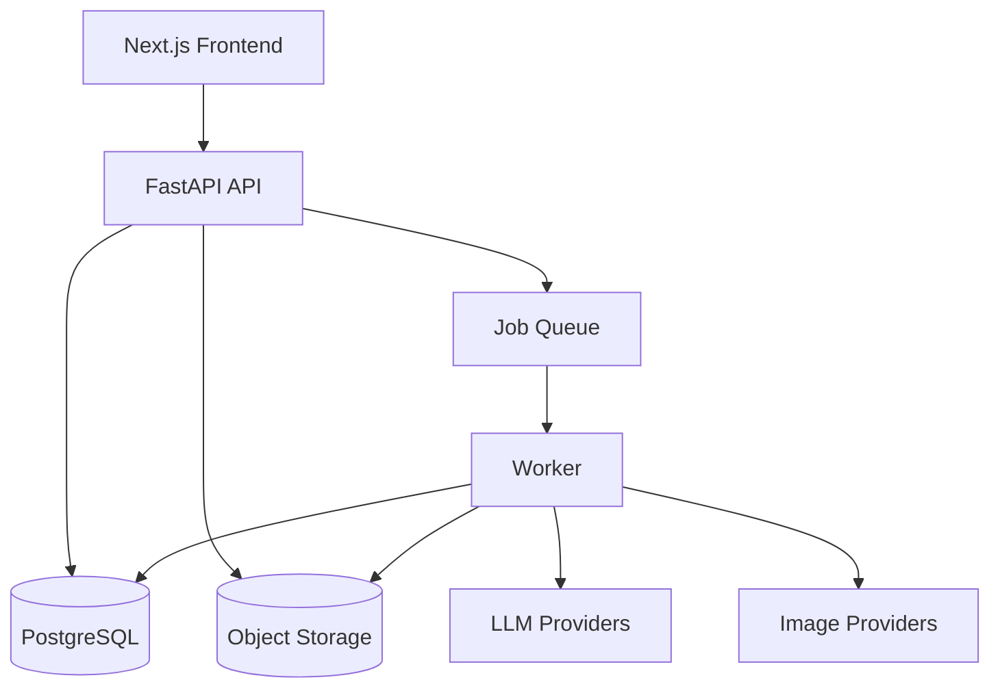

# High-Level Design

## 1. System Overview

Listing Autopilot is designed as a monorepo Python product with a Streamlit dashboard and a modular service package.

The first deployment target is Streamlit Community Cloud. FastAPI can exist as an optional local/API mode, but the primary UI calls service modules directly.

## 2. High-Level Goals

- Keep the user workflow simple: upload product photo, generate creative pack, export.
- Keep business logic independent of Streamlit.
- Support both live provider mode and demo fallback mode.
- Make the architecture extensible for a future Next.js frontend and production API.

## 3. Architecture Diagram

## 4. Runtime Modes

### Demo Mode

Used when API keys are missing or explicitly selected.

Behavior:

- product analysis uses deterministic heuristics
- image upgrade returns processed/local preview or annotated fallback
- creative pack uses template-based generation
- design JSON is deterministic

Purpose:

- reviewers can try the app without paid keys
- tests remain stable

### Live Mode

Used when provider keys are configured.

Behavior:

- product analysis uses OpenAI/Gemini vision
- image upgrade uses Replicate/Cloudinary/Photoroom/Clipdrop provider
- creative pack uses LLM structured output
- fallback is triggered if provider fails

## 5. Main Components

### Streamlit Dashboard

Responsibilities:

- upload UI
- input forms
- progress states
- result rendering
- download buttons

Non-responsibilities:

- no scoring logic
- no prompt logic
- no provider-specific logic

### Generation Service

Responsibilities:

- orchestrates the end-to-end workflow
- validates request
- calls analyzer, image upgrade, scorer, creative planner, design builder, exporters
- returns a single response object for UI/API

### Product Analyzer

Responsibilities:

- understand uploaded product photo
- detect product category, features, target customer, and visual issues
- return structured product analysis

### Image Upgrade Pipeline

Responsibilities:

- choose configured image provider
- run upgrade operation
- handle provider errors
- return original/upgraded references and metadata

### Listing Scorer

Responsibilities:

- score Amazon readiness
- generate issue list
- generate recommendations
- deterministic scoring for tests

### Creative Planner

Responsibilities:

- produce listing title, bullets, benefits, callouts, lifestyle concept, and A+ section ideas
- keep output Amazon/ecommerce specific

### Design JSON Builder

Responsibilities:

- create editable design specification
- generate layer positions
- validate layer bounds
- support future frontend canvas rendering

### Exporters

Responsibilities:

- create Markdown report
- export design JSON
- prepare ZIP export in future

## 6. Data Flow

## 7. Deployment View

## 8. External Dependencies

MVP dependencies:

- Streamlit
- Pydantic
- Pillow
- Requests
- Python dotenv
- Pytest

Optional live providers:

- OpenAI or Gemini
- Replicate
- Cloudinary

## 9. Key Design Decisions

### Decision 1: Streamlit First

Reason:

- fastest usable hosted demo
- one repo link
- one deployed app link
- enough UI for assignment

### Decision 2: Modular Backend Package

Reason:

- keeps product code production-minded
- enables future FastAPI or Next.js frontend
- makes tests easy

### Decision 3: Demo Fallback

Reason:

- reviewers may not have API keys
- external APIs can fail
- app must always demonstrate value

### Decision 4: Editable Design JSON

Reason:

- differentiates project from generic image generation
- aligns with the idea of editable listing designs
- supports future frontend canvas editor

## 10. Future Architecture

Future production version can add:

- FastAPI service
- database
- object storage
- async worker queue
- Next.js frontend
- user accounts
- batch SKU processing

