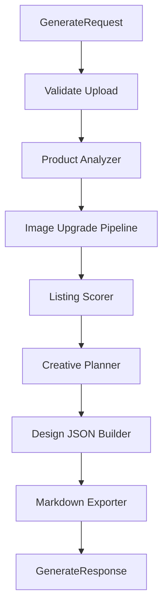
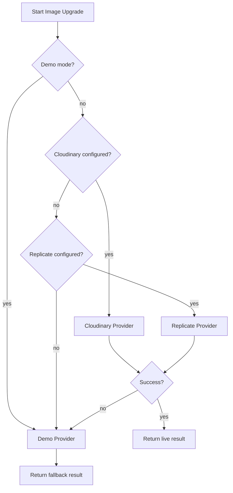

# Low-Level Design

## 1. Repository Structure

Planned structure:

```text
listing-autopilot-service/
├── README.md
├── Commands.md
├── Setup.md
├── CHANGELOG.md
├── .env.example
├── .gitignore
├── requirements.txt
├── docker-compose.yml
├── Dockerfile.api
├── main.py
│
├── docs/
│   ├── REQUIREMENTS.md
│   ├── HLD.md
│   ├── LLD.md
│   ├── API.md
│   ├── USER_FLOW.md
│   └── VIDEO_SCRIPT.md
│
├── listingautopilot/
│   ├── __init__.py
│   ├── config.py
│   ├── exceptions.py
│   ├── logging_config.py
│   │
│   ├── apis/
│   │   └── services/
│   │       ├── health.py
│   │       ├── generation.py
│   │       ├── image_upgrade.py
│   │       ├── creative_pack.py
│   │       └── export.py
│   │
│   ├── domain/
│   │   ├── products.py
│   │   ├── listings.py
│   │   ├── creatives.py
│   │   ├── design_specs.py
│   │   └── jobs.py
│   │
│   ├── schemas/
│   │   ├── request.py
│   │   ├── response.py
│   │   ├── product.py
│   │   ├── creative.py
│   │   └── design.py
│   │
│   ├── analysis/
│   │   ├── product_analyzer.py
│   │   ├── listing_scorer.py
│   │   ├── creative_planner.py
│   │   └── design_json_builder.py
│   │
│   ├── llm/
│   │   ├── client.py
│   │   ├── prompts.py
│   │   └── schemas.py
│   │
│   ├── image/
│   │   ├── upgrade_pipeline.py
│   │   └── providers/
│   │       ├── demo.py
│   │       ├── cloudinary.py
│   │       └── replicate.py
│   │
│   ├── exporters/
│   │   ├── markdown.py
│   │   ├── design_json.py
│   │   └── zip_export.py
│   │
│   └── utils/
│       ├── file_utils.py
│       ├── image_utils.py
│       └── json_utils.py
│
├── dashboard/
│   └── streamlit_app.py
│
├── tests/
│   ├── test_health.py
│   ├── test_listing_scorer.py
│   ├── test_design_json_builder.py
│   └── test_creative_planner.py
│
├── assets/
│   └── sample-product.jpg
│
├── outputs/
│   └── .gitkeep
│
└── scripts/
    ├── run_api.sh
    ├── run_dashboard.sh
    └── test.sh
```

## 2. Module Responsibilities

### `dashboard/streamlit_app.py`

Responsibilities:

- render product upload UI
- collect optional metadata
- call generation service
- show progress
- render output tabs
- provide download buttons

Should not contain:

- LLM prompts
- scoring algorithms
- provider credentials
- provider-specific business logic

### `listingautopilot/config.py`

Loads settings from environment.

Expected settings:

```python
APP_ENV
MAX_UPLOAD_MB
DEMO_MODE
OPENAI_API_KEY
OPENAI_MODEL
GEMINI_API_KEY
REPLICATE_API_TOKEN
CLOUDINARY_CLOUD_NAME
CLOUDINARY_API_KEY
CLOUDINARY_API_SECRET
OUTPUT_DIR
```

### `listingautopilot/apis/services/generation.py`

Main orchestration service.

Core function:

```python
def generate_listing_pack(request: GenerateRequest) -> GenerateResponse:
    ...
```

Flow:

1. validate request
2. analyze product
3. upgrade image
4. score listing
5. plan creative pack
6. build design JSON
7. build exports
8. return response

### `listingautopilot/analysis/product_analyzer.py`

Core function:

```python
def analyze_product(request: GenerateRequest, image_bytes: bytes) -> ProductAnalysis:
    ...
```

Responsibilities:

- call LLM client when available
- parse structured output
- fallback to demo analyzer
- normalize missing fields

### `listingautopilot/analysis/listing_scorer.py`

Core function:

```python
def score_listing(input: ListingScoreInput) -> ListingScore:
    ...
```

Scoring dimensions:

- image quality
- Amazon readiness
- conversion potential
- benefit clarity
- proof readiness

### `listingautopilot/analysis/creative_planner.py`

Core function:

```python
def plan_creative_pack(input: CreativePlanInput) -> CreativePack:
    ...
```

Responsibilities:

- title generation
- bullets
- pain points
- purchase criteria
- benefit callouts
- lifestyle concept
- infographic plan

### `listingautopilot/analysis/design_json_builder.py`

Core function:

```python
def build_design_spec(input: DesignSpecInput) -> DesignSpec:
    ...
```

Responsibilities:

- create canvas
- place product image layer
- place headline
- place callouts
- enforce layer bounds
- validate schema

### `listingautopilot/image/upgrade_pipeline.py`

Core function:

```python
def upgrade_image(request: ImageUpgradeRequest) -> ImageUpgradeResult:
    ...
```

Responsibilities:

- select provider
- run provider
- handle failures
- fallback to demo provider

### `listingautopilot/image/providers/*`

Each provider must implement the same interface:

```python
class ImageUpgradeProvider:
    name: str

    def is_configured(self) -> bool:
        ...

    def upgrade(self, request: ImageUpgradeRequest) -> ImageUpgradeResult:
        ...
```

## 3. Core Data Models

### Generate Request

```python
class GenerateRequest(BaseModel):
    product_name: str | None = None
    brand_name: str | None = None
    category: str | None = None
    target_customer: str | None = None
    brand_tone: str = "clear, premium, Amazon-friendly"
    amazon_listing_url: str | None = None
    competitor_url: str | None = None
    image_filename: str
    image_content_type: str
    image_bytes: bytes
    use_demo_mode: bool = False
```

### Product Analysis

```python
class ProductAnalysis(BaseModel):
    product_name: str
    category: str
    description: str
    visible_features: list[str]
    likely_use_cases: list[str]
    target_customer: str
    visual_issues: list[str]
    selling_angles: list[str]
```

### Listing Score

```python
class ListingScore(BaseModel):
    overall: int
    image_quality: int
    amazon_readiness: int
    conversion_potential: int
    benefit_clarity: int
    proof_readiness: int
    issues: list[str]
    recommendations: list[str]
```

### Creative Pack

```python
class CreativePack(BaseModel):
    amazon_title: str
    bullets: list[str]
    benefits: list[str]
    pain_points: list[str]
    purchase_criteria: list[str]
    main_image_recommendation: str
    lifestyle_concept: str
    infographic_headline: str
    infographic_callouts: list[str]
    a_plus_sections: list[str]
```

### Design Spec

```python
class DesignSpec(BaseModel):
    version: str = "1.0"
    canvas: CanvasSpec
    layers: list[DesignLayer]
    metadata: dict[str, str]
```

### Design Layer

```python
class DesignLayer(BaseModel):
    id: str
    type: Literal["image", "text", "badge", "shape"]
    name: str
    x: int
    y: int
    width: int
    height: int
    rotation: int = 0
    opacity: float = 1.0
    text: str | None = None
    image_ref: str | None = None
    style: dict[str, Any] = {}
```

### Generate Response

```python
class GenerateResponse(BaseModel):
    request_id: str
    mode: Literal["demo", "live", "mixed"]
    product: ProductAnalysis
    score: ListingScore
    creative_pack: CreativePack
    images: ImageBundle
    editable_design: DesignSpec
    exports: ExportBundle
    warnings: list[str]
```

## 4. Generation Pipeline



## 5. Error Handling

### Expected Error Types

```python
class ListingAutopilotError(Exception):
    code: str
    message: str
    details: dict

class ValidationError(ListingAutopilotError):
    ...

class ProviderConfigurationError(ListingAutopilotError):
    ...

class ProviderExecutionError(ListingAutopilotError):
    ...

class ExportError(ListingAutopilotError):
    ...
```

### Error Strategy

- Validation errors stop the flow.
- Product analyzer provider errors fallback to demo analyzer.
- Image provider errors fallback to demo image provider.
- Export errors are returned as warnings if core generation succeeded.

## 6. Provider Selection Logic



## 7. Test Plan

### Unit Tests

- `test_listing_scorer.py`
  - score range validation
  - issue generation
  - recommendation generation

- `test_design_json_builder.py`
  - valid canvas
  - required layers exist
  - layer bounds
  - JSON serializable

- `test_creative_planner.py`
  - required sections
  - minimum bullets
  - minimum purchase criteria

- `test_health.py`
  - config loads
  - health service returns ok

### Manual Tests

- upload valid image
- upload unsupported file
- run in demo mode
- run with missing provider keys
- export Markdown
- export design JSON

## 8. Streamlit UI Layout

```text
Top: Product input and upload

Left column:
  - uploaded image preview
  - optional metadata fields
  - generate button

Right column:
  - generation status
  - score summary

Tabs:
  1. Visuals
     - before image
     - upgraded image
     - infographic preview

  2. Creative Pack
     - title
     - bullets
     - pain points
     - purchase criteria

  3. Editable Design
     - JSON viewer
     - layer table

  4. Export
     - Markdown download
     - JSON download
```

## 9. Implementation Order

1. Create repository structure.
2. Add schemas.
3. Add deterministic demo services.
4. Add listing scorer.
5. Add creative planner.
6. Add design JSON builder.
7. Add markdown exporter.
8. Add Streamlit dashboard.
9. Add live LLM provider.
10. Add live image provider.
11. Add tests.
12. Add docs and deployment instructions.
