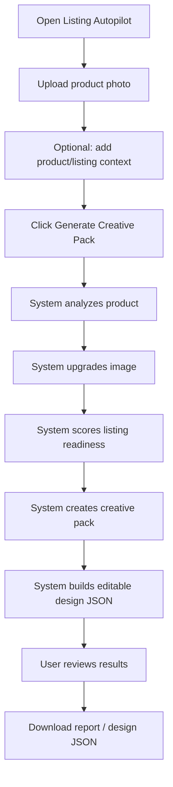
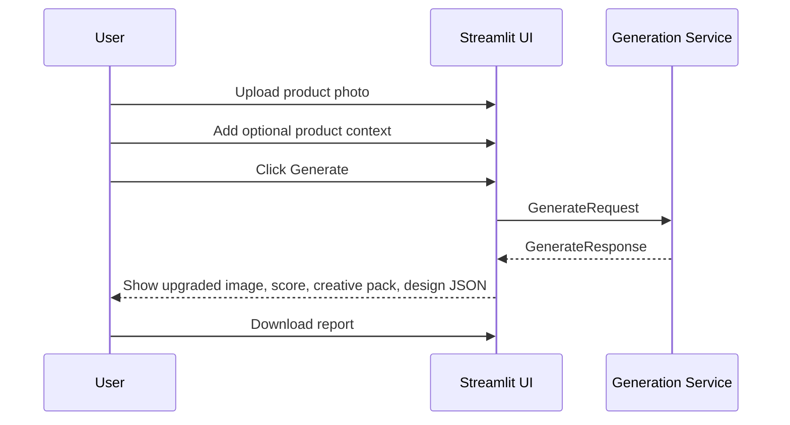
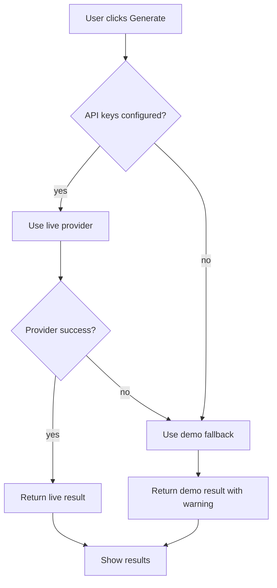
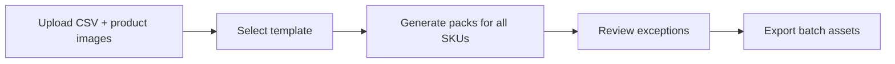
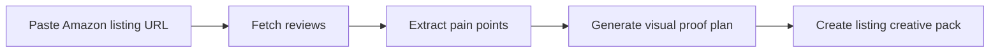
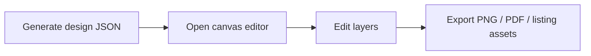

# User Flow

## 1. Primary User Journey

User goal:

> Turn one weak product photo into an Amazon-ready creative pack.



## 2. Detailed Screen Flow

### Screen 1: Upload And Context

Fields:

- product photo upload
- product name
- brand name
- category
- target customer
- Amazon listing URL
- competitor URL
- force demo mode checkbox

Primary action:

- `Generate Creative Pack`

Validation:

- image is required
- file type must be supported
- file size must be within limit

### Screen 2: Progress State

Progress steps:

1. Reading product image
2. Analyzing product and customer fit
3. Upgrading main image
4. Scoring Amazon listing readiness
5. Creating copy and creative plan
6. Building editable design JSON
7. Preparing exports

### Screen 3: Results Overview

Summary cards:

- overall score
- image quality
- Amazon readiness
- conversion potential
- provider mode: demo/live/mixed

Primary visuals:

- original image
- upgraded image
- infographic preview

### Screen 4: Creative Pack

Sections:

- Amazon title
- 5 bullets
- benefits
- customer pain points
- purchase criteria
- lifestyle concept
- main image recommendation
- A+ content ideas

### Screen 5: Editable Design

Sections:

- JSON viewer
- layer table
- canvas summary
- editable layer explanation

The user should understand that the output is not only a flat image. It is a structured design plan that a future editor could modify.

### Screen 6: Export

Downloads:

- Markdown creative report
- design JSON

Future:

- ZIP export
- PNG infographic render

## 3. Happy Path



## 4. Fallback Path

When provider keys are missing:



User-facing warning example:

```text
Demo fallback was used because live image provider is not configured.
The workflow is still fully usable for review.
```

## 5. User Experience Principles

- No prompt required from user.
- Product photo is the primary input.
- Results should feel like an Amazon creative operator’s workbench.
- Use plain ecommerce language.
- Make outputs immediately useful.
- Do not over-explain the AI internals in the UI.

## 6. Demo User Story

Persona:

> Priya runs a small Amazon brand and has a supplier photo for a stainless steel water bottle.

Problem:

> The supplier image looks plain and does not communicate why shoppers should buy.

Flow:

1. Priya uploads the photo.
2. She enters brand name and product category.
3. Listing Autopilot analyzes the product.
4. It upgrades the image for a clean Amazon main image.
5. It identifies key buying criteria like insulation, leak resistance, durability, and portability.
6. It generates title, bullets, lifestyle concept, and infographic callouts.
7. It exports an editable design JSON and Markdown report.

Outcome:

> Priya now has a clear creative direction and usable listing assets in minutes.

## 7. Future User Flows

### Batch SKU Flow



### Review-Backed Creative Flow



### Full Editor Flow


