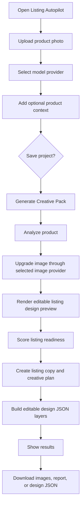
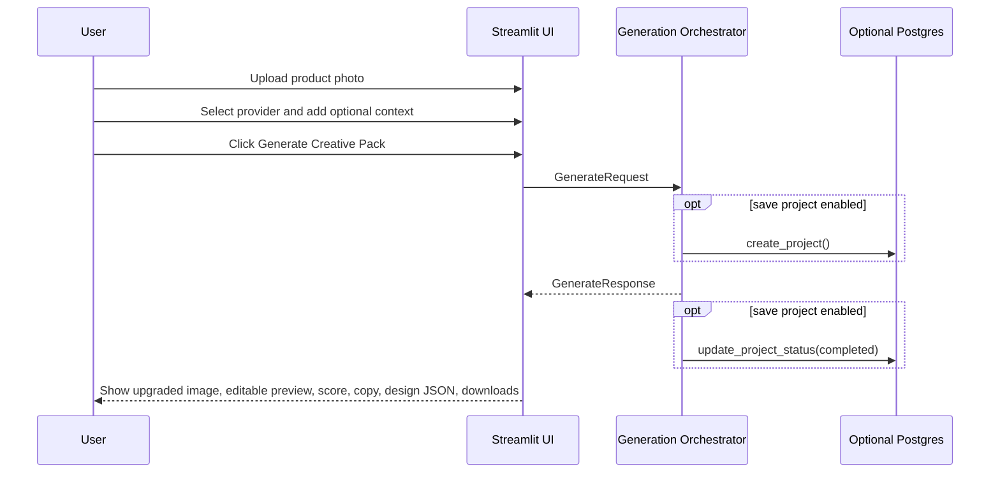
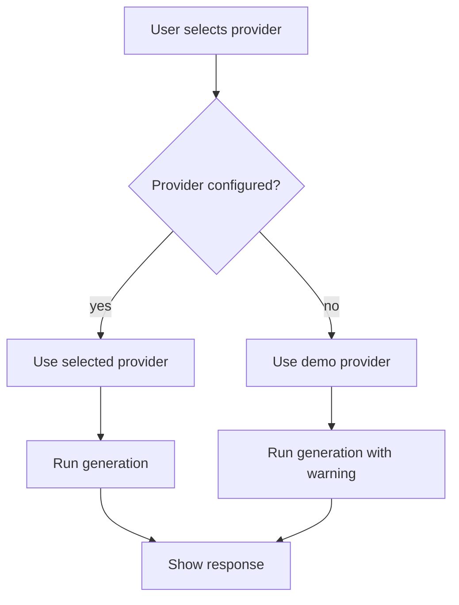
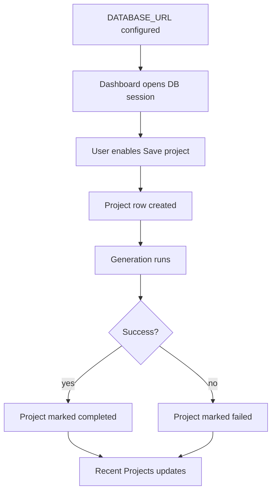
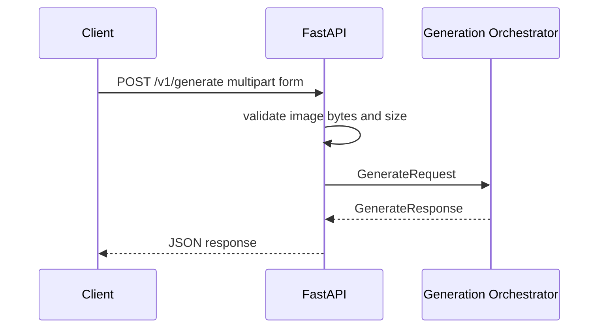
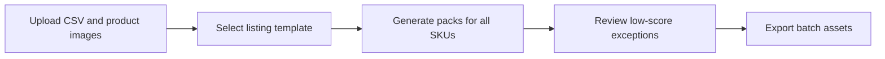
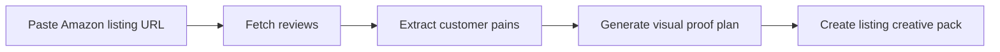
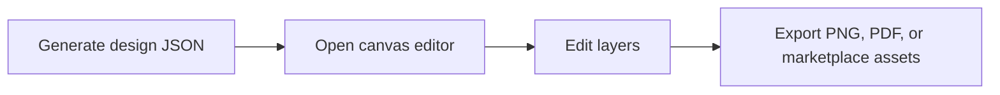

# User Flow

## 1. Primary Journey

User goal:

> Turn one weak product photo into an Amazon-ready creative pack.



## 2. Dashboard Flow

### Sidebar

Controls:

- model provider select box
- save project checkbox
- Recent Projects list when Postgres is configured

Behavior:

- Demo provider is always available.
- Live providers appear when configured.
- If `DATABASE_URL` is missing, persistence is disabled and the sidebar explains that state.
- Recent Projects shows saved project name, status, score, and last updated time.

### Main Input Area

Fields:

- product photo
- product name
- brand
- category
- target customer
- Amazon listing URL
- competitor URL
- brand tone

Primary action:

- `Generate Creative Pack`

Validation:

- Product photo is required.
- Streamlit restricts file type to `png`, `jpg`, `jpeg`, and `webp`.
- API also rejects empty files and files over `MAX_UPLOAD_MB`.

### Result Area

Displayed output:

- upgraded Amazon-ready product image
- editable listing design preview
- score metrics
- product description
- Amazon title
- bullet points
- main image recommendation
- lifestyle concept
- infographic headline and callouts
- editable design JSON
- download buttons
- warnings when fallback behavior is used

## 3. Happy Path



## 4. Demo Fallback Path



User-facing warning example:

```text
openai was not configured; demo LLM provider was used.
```

## 5. Persistence Path



When persistence is disabled:

- generation still works
- no project ID is returned
- Recent Projects shows persistence disabled

## 6. API Flow



## 7. Demo User Story

Persona:

> Priya runs a small Amazon brand and has a supplier photo for a stainless steel water bottle.

Problem:

> The supplier image looks plain and does not clearly communicate why shoppers should buy.

Flow:

1. Priya opens Listing Autopilot.
2. She uploads the supplier photo.
3. She keeps the provider as demo or selects a configured live model.
4. She enters brand name, category, and target customer.
5. She clicks `Generate Creative Pack`.
6. Listing Autopilot analyzes the product.
7. It returns an upgraded Amazon-style product image.
8. It renders a Canva-style listing design preview with editable layer JSON behind it.
9. It returns a listing score, buying criteria, title, bullets, and creative direction.
10. She downloads the images, Markdown report, and design JSON.

Outcome:

> Priya now has a clear listing creative direction and structured assets in minutes.

## 8. User Experience Principles

- The product photo is the primary input.
- The user should not need to write prompts.
- Results should feel like an ecommerce creative operator's workbench.
- Use plain marketplace language.
- Keep AI/provider details visible only where they help trust and debugging.
- Show warnings clearly when fallback is used.
- Make exports immediately useful.

## 9. Future User Flows

### Batch SKU Flow



### Review-Backed Creative Flow



### Full Editor Flow


